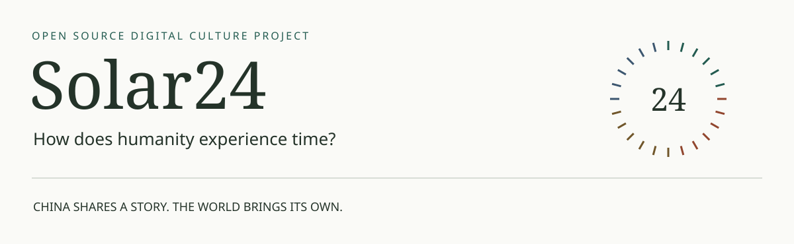
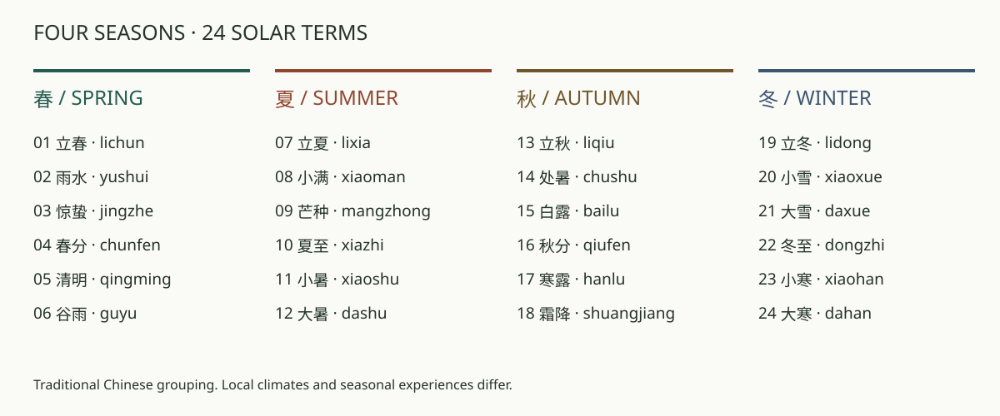
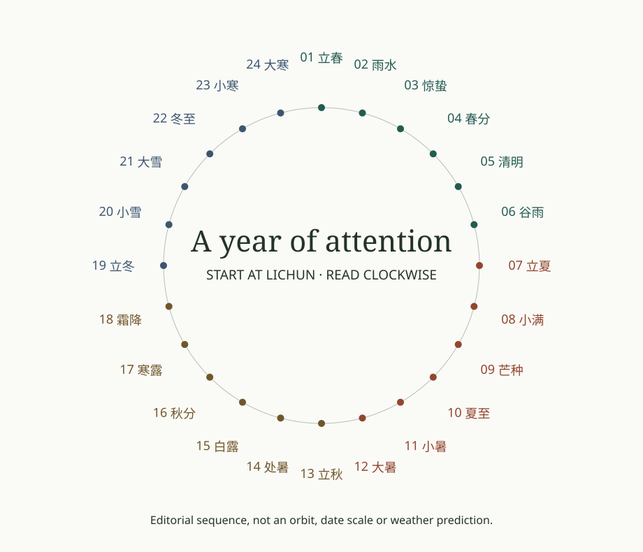

# Solar24

> **历史概览 / Archived overview**：以下保留首次工程与 Journey 建设时的项目说明，不作为当前状态页。V5 已于 2026-09-20 上线；请从 [English README](README.md)、[中文 README](README.zh-CN.md)、[制作过程](docs/development-journey/README.md)和[当前路线](docs/architecture/roadmap.md)查看最新成果。下文“尚无 Demo”等描述仅代表当时状态。

**Chinese Twenty-Four Solar Terms · Open Source Digital Culture Project**  
**二十四节气开源数字文化计划**



> **How does humanity experience time?**  
> How do different cultures express their relationship with nature and time?

Solar24 是一个以中国二十四节气为起点的开源文化表达实验：先把中国的二十四节气讲给世界听懂，再邀请世界各地的人，用自己的文化、艺术和技术，表达他们眼中的同一个时间节点。

**China shares a story. The world brings its own.** We begin with China's twenty-four solar terms, then invite people everywhere to share different experiences of nature and time.

[认识24节气](#24-solar-terms) · [体验进度](#experience) · [制作过程](#how-solar24-is-made) · [社区声音](docs/community/music-contribution.md) · [世界的表达](#an-open-invitation) · [知识库](knowledge-base/README.md) · [贡献](CONTRIBUTING.md)

## What are the Twenty-Four Solar Terms?

我们共同经历光照、季节、天气和生命的变化。二十四节气提供了一种理解一年变化的中国时间框架。按现代天文定义，太阳沿黄道的视运动以黄经每15°划分节点，共24个节气。[1]

The twenty-four solar terms mark positions in the Sun's apparent annual journey along the ecliptic, at intervals of 15 degrees.[1] They connect a way of marking time with observations of nature and human life.

它们不是24个全球统一的天气预报。同一时间，各地的气候、物候和生活经验可以很不一样；下图是传统四季编组的导航示意。



## Why do they exist?

观察太阳和季节，有助于人们认识一年中的变化。节气的名称也记录着天气和农业活动的经验；香港天文台的概览特别说明，这些名称一定程度上反映中国古代中部地区的气候。[1] 项目会进一步研究它们在不同地区、时代和生活中的具体含义。

我们的解释路径是：**太阳与时间 → 自然变化 → 农业与生活 → 人如何理解自然。** 每一步都需要说明依据和适用范围，而不是用一个地方的经验代替整个中国。



## What do they tell us about Chinese culture?

Solar24 希望通过有来源的具体故事，探索中国人如何观察、记忆和回应自然：农业、饮食、习俗、文学以及当代生活。当前这些故事尚待研究与人工审核。我们不会用一段概括替所有中国人作答。

**Culture > Experience > Design > Technology**

[七项项目原则](PRINCIPLES.md)要求文化准确、解释清晰、可访问、来源可追溯；AI 可以辅助研究和创作，事实必须由人核验。

## Experience

> **Experience placeholder · 工程骨架预览**  
> 当前可在本地打开24个模块入口；立春为静态 Reference Prototype。尚无完整数字体验、正式3D场景、音乐或在线 Demo。这里没有虚构截图。

未来每个体验通过图像、动画、声音、交互和简洁文字回答 WHAT / WHY / NATURE / PEOPLE / CULTURE。每种效果都要解释一个问题；无需音频或 WebGL，也应能读懂核心内容。

先体验光照如何变化，再阅读它的天文背景；先看见自然现象，再了解当地人的生活。以上是设计方向，不是已交付的交互功能。

## An open invitation

**这个时间，在你生活的地方意味着什么？**  
**What does this time mean where you live?**

中国二十四节气是对话的起点。世界不同地方可以分享相近时间、相似自然现象、不同半球的季节、生命变化与日常经验。我们同样关注 **similarity** 和 **difference**，无需寻找一个“对应的节日”。中国各地的社区也属于这个邀请。

Open Source Cultural Expression Protocol 是让文化内容、证据、艺术作品和代码可以被理解、引用、修改与协作的方法。它记录创作者、地点、文化背景、关联理由、差异、来源和许可。

邀请从一开始存在。[社区音乐指南](docs/community/music-contribution.md)与结构化 Issue Form 已在仓库建立，合入 GitHub 默认分支后可从 New issue 投稿；[全球表达协议](docs/protocol/global-expression.md)保留文化关系边界。当前没有收录作品、精选名单或独立在线投稿平台。

## How Solar24 Is Made

这里不仅保存代码，也展示一个文化数字体验如何从研究走向作品，以及多个原型为什么改变。你可以沿着真实材料、设计取舍与检查记录学习 AI 辅助开发过程；草稿、原型与正式发布始终分开。

```text
Research
↓
Story
↓
Visual
↓
Sound
↓
Interaction
↓
Code
↓
Experience
```

[Development Journey · 完整11阶段与模板](docs/development-journey/README.md) · [V1–V4 设计演进](docs/development-journey/prototype-evolution.md) · [立春制作记录](docs/development-journey/lichun/00-overview.md) · [重大决策 ADR](docs/decisions/README.md)

体验之后，邀请你带来自己的表达：**为什么这段声音属于你对这个节气的理解？** 一句话创意、Demo、原创音乐、实录或 AI 辅助创作都可参与；不要求专业音乐背景。[参与音乐贡献](docs/community/music-contribution.md) · [社区入口与署名](docs/community/README.md)。Accepted 不等于 Featured，精选由真实 Curator 说明理由。

## 24 Solar Terms

立春 **Prototype（仅工程骨架）**；其余 **Planned**。所有文化正文均 **draft**，没有已批准的文化知识数据集。英文名称为导航译名，不表示全文翻译已完成。

| 春 Spring                                        | 夏 Summer                                          | 秋 Autumn                                              | 冬 Winter                                      |
| ------------------------------------------------ | -------------------------------------------------- | ------------------------------------------------------ | ---------------------------------------------- |
| [01 立春 · lichun](modules/lichun/README.md)     | [07 立夏 · lixia](modules/lixia/README.md)         | [13 立秋 · liqiu](modules/liqiu/README.md)             | [19 立冬 · lidong](modules/lidong/README.md)   |
| [02 雨水 · yushui](modules/yushui/README.md)     | [08 小满 · xiaoman](modules/xiaoman/README.md)     | [14 处暑 · chushu](modules/chushu/README.md)           | [20 小雪 · xiaoxue](modules/xiaoxue/README.md) |
| [03 惊蛰 · jingzhe](modules/jingzhe/README.md)   | [09 芒种 · mangzhong](modules/mangzhong/README.md) | [15 白露 · bailu](modules/bailu/README.md)             | [21 大雪 · daxue](modules/daxue/README.md)     |
| [04 春分 · chunfen](modules/chunfen/README.md)   | [10 夏至 · xiazhi](modules/xiazhi/README.md)       | [16 秋分 · qiufen](modules/qiufen/README.md)           | [22 冬至 · dongzhi](modules/dongzhi/README.md) |
| [05 清明 · qingming](modules/qingming/README.md) | [11 小暑 · xiaoshu](modules/xiaoshu/README.md)     | [17 寒露 · hanlu](modules/hanlu/README.md)             | [23 小寒 · xiaohan](modules/xiaohan/README.md) |
| [06 谷雨 · guyu](modules/guyu/README.md)         | [12 大暑 · dashu](modules/dashu/README.md)         | [18 霜降 · shuangjiang](modules/shuangjiang/README.md) | [24 大寒 · dahan](modules/dahan/README.md)     |

## Why open source?

开放的不只是代码，还有研究方法、解释结构、引用和参与方式。研究者可以补充证据，创作者可以重新表达，翻译者可以帮助不同语言的读者理解；每个人都能指出错误并参与更正。代码许可与文化/媒体许可分别处理。

## Architecture


Obsidian 是知识大脑，GitHub 是开源协作空间，Web 是文化体验入口，AI 是研究与生产工具。研究草稿不会自动进入产品。

```text
modules/lichun/
├── module.manifest.json   # 身份、能力与工程状态
├── content/zh-CN.json     # 显式编辑的生产内容（当前 draft）
├── references.json       # 来源快照（当前为空）
├── assets/manifest.json  # 媒体与许可（当前为空）
├── src/index.ts          # 共享运行时挂载入口
├── tests/                # 测试责任与扩展说明
├── package.json          # 独立 dev / test / build
└── README.md             # 文化叙事模板
```

[完整架构](docs/architecture/overview.md) · [Module Protocol](docs/protocol/module-protocol.md) · [Knowledge Schema](docs/protocol/knowledge-schema.md) · [AI Research Workflow](docs/research/ai-research-workflow.md)

## Roadmap

| 阶段               | 目标                              | 当前                                                                     |
| ------------------ | --------------------------------- | ------------------------------------------------------------------------ |
| 工作区初始化       | 工程、研究层、协议和文档          | 本版本                                                                   |
| 立春研究           | 可核查来源、小颗粒节点、人审      | 任务草案                                                                 |
| 立春参考体验       | 已审核文化内容＋一个解释性互动    | 待开发                                                                   |
| 24 模块逐步完善    | 按季节批次研究与实现              | Planned                                                                  |
| 制作过程与社区声音 | Journey、原型演进、音乐投稿与校验 | 规范、模板与数据契约已建立；尚无真实收录（现有全球研究候选不是社区投稿） |

## Technical details

TypeScript + React + Vite + pnpm；Zod 校验协议，Vitest 验证契约，Playwright 验证主要浏览路径。Three.js、GLSL、GSAP、Web Audio、GLTF/GLB 按实际叙事需求引入，当前没有为它们创建空壳系统。静态构建适配 GitHub Pages / Cloudflare Pages，无后端。

要求 Node 22.13+（22.x）或 24+ 与 pnpm 10.34.5：

```sh
pnpm install
pnpm dev
pnpm --filter @solar24/module-lichun dev
pnpm lint
pnpm test
pnpm build
```

构建产物：`apps/host/dist`。浏览器测试：`pnpm exec playwright install chromium` 后 `pnpm test:e2e`。更多见 [开发说明](docs/architecture/development.md)。

## Sources & rights

[1] [Hong Kong Observatory — The 24 Solar Terms](https://www.hko.gov.hk/en/gts/time/24solarterms.htm)，页面标示修订日期 2020-05-18；初始化时 2026-09-16 读取，用于上文基础说明。书目与短摘录见 [Source 记录](knowledge-base/04_sources/source-hko-solar-terms.md)。**该记录目前为 AI 辅助整理、待人工审核**，未导入已批准生产文化数据。

本 README 的图为实际存在的本地原创说明 SVG，顺序/四季示意不冒充科学模拟或体验截图。见 [图表来源和许可](assets/docs/manifest.json)。代码与原创工程说明采用 [MIT](LICENSE)；文化资料、第三方媒体和未来 AI 资产分别声明授权，详见 [许可边界](docs/contributing/licensing.md)。
