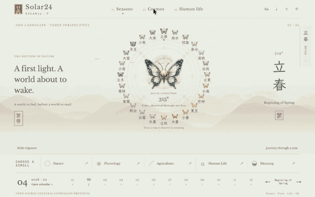

# Solar24

**A living book of China's twenty-four solar terms.**

English · [简体中文](README.zh-CN.md)

[Open the English demo](https://solar24-demo.solar24.workers.dev/?lang=en#lichun/seasons) · [中文 Demo](https://solar24-demo.solar24.workers.dev/?lang=zh#lichun/seasons)

## Demo walkthrough

**Animated preview · Seasons → reading scroll → Cosmos → Human life**



[Open the GIF directly](https://github.com/aiwindyjm/solar24/raw/refs/heads/main/assets/demo/walkthrough-en.gif) · [Try the live demo](https://solar24-demo.solar24.workers.dev/?lang=en#lichun/seasons)

If GitHub pauses the animation, use the image's play button or open the GIF directly.

Follow a butterfly through the year. Open a translucent reading scroll. Rise from an ink landscape to the Sun and Earth, then return to small acts of everyday life.

## Explore

- **Seasons:** 24 butterfly nodes, changing palettes, five independent reading scrolls, and a calendar that advances with the year tour.
- **Cosmos:** a three-dimensional Sun–Earth scene, two camera positions, and a short explanation of solar longitude and Earth's tilt.
- **Human life:** seasonal listening prompts, interactive drawings and memories saved only in your browser. Try tea leaves at Grain Rain or counting winter days at Winter Solstice.

English and Chinese have separate shareable links and typography choices. Sound is off by default; the optional ambience is synthesized. Reading, fonts and imagery are served with the site, with external references available only as further reading. Reduced-motion and static-scene alternatives are included.

## Run the demo

Use Node 22.13+ (22.x) or 24+, and pnpm 10.34.5.

```sh
pnpm install --frozen-lockfile
pnpm demo:dev
```

Open `http://127.0.0.1:5176/`. Build with `pnpm demo:build`, preview with `pnpm demo:preview`, or deploy with `pnpm demo:deploy` after Cloudflare login.

The demo lives in [`docs/design/solar24-v5`](docs/design/solar24-v5/). It uses React, TypeScript, Vite, Three.js and Web Audio, hosted as static assets on Cloudflare. No backend or account is needed to explore it.

## How Solar24 Is Made

From a world-calendar concept to an ink landscape, then a butterfly year wheel, continuous 3D space and an interactive book: five iterations shaped the live demo. Reading, astronomy, seasonal participation and bilingual publishing now form one connected experience.

[Follow the making process](docs/development-journey/README.en.md) · [Design evolution](docs/development-journey/prototype-evolution.md) · [V0.1.0 public release](docs/releases/solar24-v0.1.0-demo.md) · [Release record](docs/development/v5-demo-release.md)

Next: reader observation with Lichun, production content review, and performance measurements on real devices. [Current roadmap](docs/architecture/roadmap.md). Version milestones are recorded in [GitHub Releases](https://github.com/aiwindyjm/solar24/releases); routine commits and CI checks do not create releases automatically.

## Project

Solar24 is an open-source cultural expression project: China shares a story, and people everywhere can bring their own observations of time and nature. Culture, experience and design guide the technology.

- [Project background · archived overview](PROJECT.md)
- [Architecture](docs/architecture/overview.md)
- [Development journey](docs/development-journey/README.en.md)
- [Community sound contributions](docs/community/music-contribution.md)
- [Contributing](CONTRIBUTING.md)
- [Deployment guide](docs/design/solar24-v5/DEPLOYMENT.md)

The public demo is a visual experience developed separately from the production Host and its content-review gates. Publishing it does not change the knowledge base's review status. The orbit is an artistic teaching model, not a live ephemeris; local practices retain their geographic context.

Code is [MIT licensed](LICENSE). Fonts retain their OFL licenses. Butterfly artwork and recordings of the demo are not granted a separate reuse license by the code license; see [media notes](assets/demo/README.md).
