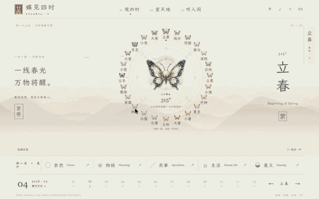

# Solar24 · 蝶见四时

**一本可以走进去的二十四节气介绍书。**

[English](README.md) · 简体中文

[进入中文 Demo](https://solar24-demo.solar24.workers.dev/?lang=zh#lichun/seasons) · [English Demo](https://solar24-demo.solar24.workers.dev/?lang=en#lichun/seasons)

## 操作动图

**动态演示 · 观四时 → 展开手卷 → 望天地 → 听人间**



[直接打开动图](https://github.com/aiwindyjm/solar24/raw/refs/heads/main/assets/demo/walkthrough-zh.gif) · [进入在线 Demo](https://solar24-demo.solar24.workers.dev/?lang=zh#lichun/seasons)

如果 GitHub 暂停了动画，可点击图片上的播放按钮，或直接打开动图查看。

跟随蝴蝶走过一年，在水墨山水中舒展阅读。从山间升向太阳与地球，再回到日常生活里的微小变化。

## 三种观看尺度

- **观四时**：24 只蝴蝶构成时间年轮，环境色随节气变化。自然、物候、农事、生活、意义分别展开独立手卷；漫游一年时，日历同步逐日推进。
- **望天地**：进入具有透视和光照的太阳—地球三维空间，切换太阳周年与地球近观，理解太阳黄经和地轴倾角。
- **听人间**：每个节气都有聆听提示、写意动作和个人记忆。可以在谷雨舒展茶叶，在冬至逐点体验消寒计数。记忆只保存在本机。

中英文有各自可分享的链接与字体选择。声音默认关闭，开启后为合成环境音。正文、字体和图像随站点提供，外部来源仅作延伸阅读。支持减少动态与静态山水降级。

## 本地运行

使用 Node 22.13+（22.x）或 24+，以及 pnpm 10.34.5。

```sh
pnpm install --frozen-lockfile
pnpm demo:dev
```

打开 `http://127.0.0.1:5176/`。`pnpm demo:build` 构建静态文件，`pnpm demo:preview` 预览构建结果；完成 Cloudflare 登录后，使用 `pnpm demo:deploy` 部署。

Demo 位于 [`docs/design/solar24-v5`](docs/design/solar24-v5/)，采用 React、TypeScript、Vite、Three.js 和 Web Audio，通过 Cloudflare 分发静态资源。浏览无需账号，不依赖后端。

## How Solar24 Is Made · 制作过程

从世界历法概念，到水墨山水、蝴蝶年轮、连续三维空间，再到可交互的节气介绍书，五版迭代逐步形成了当前 Demo。阅读、天文解释、节气生活与双语发布已经连成一条体验路径。

[查看完整制作过程](docs/development-journey/README.md) · [V1–V5 设计演进](docs/development-journey/prototype-evolution.md) · [版本交付记录](docs/development/v5-demo-release.md)

下一轮聚焦立春读者观察、生产内容核验与真机性能测量，见[当前路线图](docs/architecture/roadmap.md)。

## 项目与参与

Solar24 从中国二十四节气出发，邀请不同地方的人分享对时间与自然的观察。文化、体验、设计先于技术。

- [项目背景 · 历史概览](PROJECT.md)
- [总体架构](docs/architecture/overview.md)
- [制作过程](docs/development-journey/README.md)
- [社区声音投稿](docs/community/music-contribution.md)
- [贡献指南](CONTRIBUTING.md)
- [部署说明](docs/design/solar24-v5/DEPLOYMENT.md)

公开 Demo 与生产 Host 的内容审核流程独立，展示不改变知识库审核状态。天文空间为艺术化教学模型；地方生活保留地域背景。

代码采用 [MIT 许可](LICENSE)，字体保留 OFL 许可。代码许可不包含蝴蝶素材及相关录屏的独立再利用授权，详见 [媒体说明](assets/demo/README.md)。
