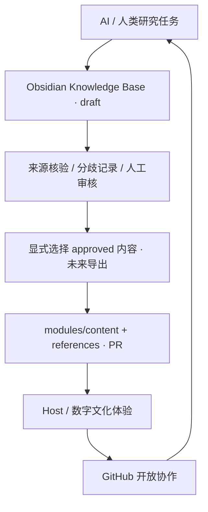

# Solar24 总体架构 · V0.1

Solar24 以中国二十四节气为起点，把中国文化解释给世界听懂，并邀请不同地方的人分享同一时间及相近自然现象中的不同经验。差异与相似同样值得记录。第一版聚焦中国，不建立世界文化大全。

## 两个层次，一个工作区



Vault 是研究层，GitHub 是产品协作层，Web 是体验入口。两层位于同一 Git 工作区以便追溯，但通过目录、审核门槛和构建依赖严格隔离。不是建立第二个 Git 仓库。Vault 公共、获授权的笔记可以版本控制；私人资料和个人 Obsidian 配置不可发布。Host 只加载 modules 的静态数据/入口，绝不扫描 Vault。

## 最终目录

```text
solar24/（当前目录保持原名 24节气）
├── apps/host/                    # 一个 Vite Host，也承担单模块预览
├── packages/
│   ├── protocol/                 # Zod、TS、模块接口、审核门槛
│   └── module-runtime/           # React 静态骨架及资源生命周期
├── modules/{24 slugs}/           # 独立 manifest/content/src/assets/references
├── modules/_template/            # README 与开发约定
├── content/                      # 跨模块编辑规则；不重复节气事实
├── data/                         # 未来派生索引约定，不手工存第二份内容
├── assets/docs/                  # 实际存在的 SVG 说明图、资产记录
├── knowledge-base/              # 独立 Obsidian Vault
├── docs/{architecture,protocol,design,research,contributing}/
├── docs/{development-journey,development,decisions,community}/ # 制作过程与参与规范
├── scripts/                     # 校验、schema 导出、单模块命令
├── scripts/content-pipeline/     # 审核到产品的未来转换契约
├── tests/                       # 共享契约与 E2E
├── .github/                     # CI、PR 和研究任务模板
└── README.md / AGENTS.md / CONTRIBUTING.md / LICENSE
```

## 依赖方向

Host → protocol；modules → module-runtime → protocol。禁止 modules 互相依赖、packages 反向依赖 Host，以及生产入口引用 knowledge-base。共享能力有实际第二个使用者再抽包，Three.js/GSAP/音频等在体验需求明确后按需接入。

每个模块使用相同 Host 单模块模式独立 dev/build，通过过滤运行契约测试。避免复制 24 套 Vite、React 和 CI。静态部署采用相对资源路径和 hash 路由，无服务器重写要求。

## 制作过程与社区声音

[Journey](../development-journey/README.md)引用研究/原型/实现，不复制生产内容。音乐真实投稿未来通过显式 PR 放本节气 `community/music/<id>.json`；没有作品时不建空目录。权威 schema 与审核门槛位于现有 protocol 包，校验脚本与现有 CI 消费；Host 当前不导入这些投稿，也不读取研究 Vault。详见 [Community Expression Protocol](../protocol/community-expression.md)。
